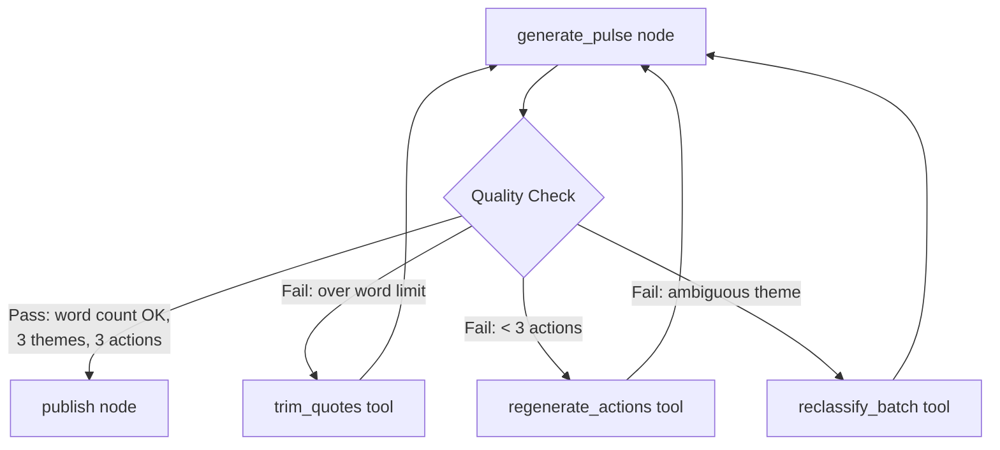

# Groww — Agentic AI Use Case: LangChain & LangGraph Integration

> **Version:** 0.1 (Draft)
> **Date:** 2026-05-14
> **Status:** Draft — Pending Review
> **Author:** Shiv
> **Related Docs:** [architecture.md](architecture.md) · [decision.md](decision.md) · [phase-wise-implementationplan.md](phase-wise-implementationplan.md)

---

## 1. Overview

This document proposes integrating **LangChain** and **LangGraph** into the Groww Automated Weekly Product Review Pulse pipeline. The goal is to evolve the current linear, script-driven pipeline into a proper **agentic AI system** — one with a stateful execution graph, composable LLM chains, and the foundation for an autonomous review-quality agent loop.

The integration is **additive and non-breaking**: all existing phase modules (`grouper.py`, `pulse_note.py`, scrapers, PII scrubber, etc.) remain intact. LangChain and LangGraph wrap and orchestrate them — they do not replace the underlying logic.

---

## 2. Current State vs. Target State

### 2.1 Current State

The pipeline is a **linear sequence of independent CLI scripts**. Each phase is invoked manually or in sequence, with no shared state, no orchestration layer, and no agent loop.

```
run_scraper.py
    ↓
run_phase1.py
    ↓
run_phase2.py   ← raw Groq SDK call (grouper.py)
    ↓
run_phase3.py   ← raw Groq SDK call (pulse_note.py)
    ↓
(Phase 4 — not yet implemented)
```

**Pain points with the current approach:**
- `main.py` is a stub — the pipeline has no single entry point
- LLM calls are tightly coupled to the `groq` SDK; swapping providers requires code changes
- Retry logic is duplicated across `grouper.py` and `pulse_note.py` via `tenacity`
- No shared pipeline state — data is passed via CSV files on disk between phases
- No conditional flow — `--dry-run` and `--scrape` flags are parsed but not wired
- No observability — no tracing, no step-level logging of LLM inputs/outputs
- Adding Phase 4 (MCP publish) requires manually wiring it into `main.py`

### 2.2 Target State

```
main.py  →  LangGraph StateGraph
              │
              ├── Node: scrape          (Phase1A orchestrator)
              ├── Node: ingest          (Phase1 csv_loader + date_filter)
              ├── Node: pii_scrub       (Phase1 scrubber)
              ├── Node: classify_themes (Phase2 grouper — LangChain chain)
              ├── Node: generate_pulse  (Phase3 pulse_note — LangChain chain)
              └── Node: publish         (Phase4 MCP clients)
                         ↑
              Conditional edges handle --dry-run, --scrape, failures
```

LLM calls inside `classify_themes` and `generate_pulse` nodes use **LangChain chains** (`ChatGroq` + `ChatPromptTemplate` + output parsers) instead of raw SDK calls.

---

## 3. Where LangChain Fits — LLM Chain Layer

### 3.1 Scope

LangChain replaces the raw `groq` SDK calls in two files:

| File | Current | With LangChain |
|---|---|---|
| `Phase2-themes/grouper.py` | `Groq(api_key=...).chat.completions.create(...)` | `ChatGroq` + `ChatPromptTemplate` + `JsonOutputParser` |
| `Phase3-generator/pulse_note.py` | `Groq(api_key=...).chat.completions.create(...)` | `ChatGroq` + `ChatPromptTemplate` + `StrOutputParser` |

### 3.2 Phase 2 — Theme Classification Chain

**Current flow in `grouper.py`:**
```python
# Manual prompt building
prompt = CLASSIFY_PROMPT_V1.format(theme_list=..., fallback=..., reviews_json=...)
# Raw SDK call
response = self._client.chat.completions.create(model=..., messages=[...])
# Manual JSON parsing
assignments = self.parse_response(response.choices[0].message.content)
```

**With LangChain:**
```python
from langchain_groq import ChatGroq
from langchain_core.prompts import ChatPromptTemplate
from langchain_core.output_parsers import JsonOutputParser

llm = ChatGroq(model="llama-3.3-70b-versatile", temperature=0.0)
prompt = ChatPromptTemplate.from_template(CLASSIFY_PROMPT_V1)
parser = JsonOutputParser()

# Composable chain
classify_chain = prompt | llm | parser

# Invoke
assignments = classify_chain.invoke({
    "theme_list": theme_list,
    "fallback": fallback,
    "reviews_json": reviews_json,
})
```

**Benefits:**
- `JsonOutputParser` handles JSON extraction and markdown fence stripping — replaces `parse_response()`
- `.with_retry()` replaces the `tenacity` decorator on `_call_llm()`
- Swapping to OpenAI is a one-line change: `ChatOpenAI(...)` instead of `ChatGroq(...)`
- LangSmith tracing captures every prompt/response pair automatically

### 3.3 Phase 3 — Action Generation Chain

**Current flow in `pulse_note.py`:**
```python
# Manual f-string prompt
prompt = f"""You are a product manager at Groww...\nTHEMES THIS WEEK:\n{theme_summary}\n..."""
# Raw SDK call
raw = self._client.chat.completions.create(model=..., messages=[...])
# Manual regex parsing
actions = self._parse_actions(raw.choices[0].message.content)
```

**With LangChain:**
```python
from langchain_groq import ChatGroq
from langchain_core.prompts import ChatPromptTemplate
from langchain_core.output_parsers import StrOutputParser

llm = ChatGroq(model="llama-3.3-70b-versatile", temperature=0.3)
prompt = ChatPromptTemplate.from_template(ACTION_PROMPT_TEMPLATE)

action_chain = prompt | llm | StrOutputParser()

raw = action_chain.invoke({"theme_summary": theme_summary})
actions = self._parse_actions(raw)  # existing regex parser still used
```

### 3.4 Prompt Management

`Phase2-themes/prompts.py` already stores versioned prompt strings (`CLASSIFY_PROMPT_V1`). With LangChain, these become `ChatPromptTemplate` objects — the versioning convention stays the same, just the type changes.

```python
# prompts.py (updated)
from langchain_core.prompts import ChatPromptTemplate

CLASSIFY_CHAIN_V1 = ChatPromptTemplate.from_template(CLASSIFY_PROMPT_V1)
ACTION_CHAIN_V1   = ChatPromptTemplate.from_template(ACTION_PROMPT_TEMPLATE)
```

---

## 4. Where LangGraph Fits — Pipeline Orchestration Layer

### 4.1 Scope

LangGraph replaces the disconnected CLI scripts with a single **`StateGraph`** in `main.py`. Each pipeline phase becomes a node; data flows through a shared `PipelineState` TypedDict instead of CSV files on disk.

### 4.2 Pipeline State

```python
from typing import TypedDict, Optional
import pandas as pd

class PipelineState(TypedDict):
    # Config
    weeks:       int
    dry_run:     bool
    scrape:      bool
    csv_dir:     Optional[str]

    # Data flowing between nodes
    raw_df:      Optional[pd.DataFrame]   # after scrape node
    clean_df:    Optional[pd.DataFrame]   # after ingest + pii_scrub nodes
    theme_groups: Optional[dict]          # after classify_themes node
    pulse_note:  Optional[object]         # after generate_pulse node

    # Outputs (Phase 4 — master doc append + Gmail draft)
    doc_id:      Optional[str]            # GOOGLE_MASTER_DOC_ID after append
    doc_url:     Optional[str]            # shareable Google Docs URL
    draft_id:    Optional[str]            # Gmail draft ID (never auto-sent)
    publish_log: Optional[str]            # path to output/logs/publish_YYYY-MM-DD.json

    # Error tracking
    errors:      list[str]
```

### 4.3 Graph Structure

```python
from langgraph.graph import StateGraph, END

graph = StateGraph(PipelineState)

# Register nodes
graph.add_node("scrape",           scrape_node)
graph.add_node("ingest",           ingest_node)
graph.add_node("pii_scrub",        pii_scrub_node)
graph.add_node("classify_themes",  classify_themes_node)
graph.add_node("generate_pulse",   generate_pulse_node)
graph.add_node("publish",          publish_node)

# Entry point — conditional on --scrape flag
graph.set_conditional_entry_point(
    lambda state: "scrape" if state["scrape"] else "ingest"
)

# Linear edges for the happy path
graph.add_edge("scrape",          "ingest")
graph.add_edge("ingest",          "pii_scrub")
graph.add_edge("pii_scrub",       "classify_themes")
graph.add_edge("classify_themes", "generate_pulse")

# Conditional edge: skip publish on --dry-run
graph.add_conditional_edges(
    "generate_pulse",
    lambda state: END if state["dry_run"] else "publish",
)
graph.add_edge("publish", END)

pipeline = graph.compile()
```

### 4.4 Node Implementations

Each node is a thin wrapper that calls the existing phase module and updates the state:

```python
def scrape_node(state: PipelineState) -> PipelineState:
    from src.Phase1A_scraper.orchestrator import ReviewScraperOrchestrator
    orchestrator = ReviewScraperOrchestrator()
    state["raw_df"] = orchestrator.scrape_all()
    return state

def ingest_node(state: PipelineState) -> PipelineState:
    from src.Phase1_ingestion.csv_loader import ReviewIngestion
    from src.Phase1_ingestion.date_filter import filter_date_range
    ingestion = ReviewIngestion()
    df = ingestion.load_scraped_csvs(state.get("csv_dir", "data/raw/"))
    state["clean_df"] = filter_date_range(df, weeks=state["weeks"])
    return state

def pii_scrub_node(state: PipelineState) -> PipelineState:
    from src.Phase1_pii.scrubber import PIIScrubber
    scrubber = PIIScrubber()
    state["clean_df"] = scrubber.scrub_dataframe(state["clean_df"], ["review_text", "title"])
    return state

def classify_themes_node(state: PipelineState) -> PipelineState:
    from src.Phase2_themes.grouper import ThemeGrouper
    grouper = ThemeGrouper()
    state["theme_groups"] = grouper.group_reviews(state["clean_df"])
    return state

def generate_pulse_node(state: PipelineState) -> PipelineState:
    from src.Phase3_generator.pulse_note import PulseNoteGenerator
    generator = PulseNoteGenerator()
    state["pulse_note"] = generator.generate(state["theme_groups"])
    return state

def publish_node(state: PipelineState) -> PipelineState:
    from src.Phase4_mcp.google_docs_client import MCPGoogleDocsClient
    from src.Phase4_mcp.gmail_client import MCPGmailClient
    # Phase 4 — custom MCP: append to GOOGLE_MASTER_DOC_ID, create draft only
    docs = MCPGoogleDocsClient()
    doc_id, doc_url = docs.append_pulse_section(
        doc_id=os.environ["GOOGLE_MASTER_DOC_ID"],
        markdown=state["pulse_markdown"],
        week_label=state["week_label"],
    )
    gmail = MCPGmailClient()
    state["draft_id"] = gmail.create_draft(
        to=os.environ["PULSE_EMAIL_RECIPIENT"],
        subject=f"[Weekly Pulse] Groww App Reviews — Week of {state['week_label']}",
        body=state["pulse_email_body"],
        doc_url=doc_url,
    )
    state["doc_id"] = doc_id
    state["doc_url"] = doc_url
    state["publish_log"] = write_publish_log(doc_id, doc_url, state["draft_id"])
    return state
```

### 4.5 Updated `main.py` Entry Point

```python
def main() -> None:
    args = parse_args()

    initial_state: PipelineState = {
        "weeks":    args.weeks,
        "dry_run":  args.dry_run,
        "scrape":   args.scrape,
        "csv_dir":  args.csv,
        "raw_df":   None,
        "clean_df": None,
        "theme_groups": None,
        "pulse_note":   None,
        "doc_id":   None,
        "doc_url":  None,
        "draft_id": None,
        "publish_log": None,
        "errors":   [],
    }

    result = pipeline.invoke(initial_state)

    if result.get("doc_id"):
        logger.info("Master doc ID: %s", result["doc_id"])
    if result.get("doc_url"):
        logger.info("Master doc URL: %s", result["doc_url"])
    if result.get("draft_id"):
        logger.info("Gmail draft ID: %s", result["draft_id"])
    if result.get("publish_log"):
        logger.info("Publish log: %s", result["publish_log"])
```

---

## 5. Optional — Agentic Review Quality Loop (Phase 5+)

This is the most "agentic" use case and is proposed for Phase 5 or beyond. It introduces a **self-correcting loop** where the agent can re-classify ambiguous reviews or rewrite sections of the pulse note that fail quality checks.

### 5.1 Concept



### 5.2 Tools for the Agent

```python
from langchain_core.tools import tool

@tool
def check_word_count(note_text: str, limit: int = 250) -> dict:
    """Check if the pulse note is within the word limit."""
    count = len(note_text.split())
    return {"count": count, "within_limit": count <= limit}

@tool
def reclassify_ambiguous_reviews(review_ids: list[int], hint: str) -> dict:
    """Re-run theme classification on a subset of reviews with an additional hint."""
    ...

@tool
def regenerate_actions(theme_summary: str, feedback: str) -> list[str]:
    """Regenerate action recommendations with additional context or feedback."""
    ...
```

### 5.3 Agent Loop Pattern

```python
from langgraph.prebuilt import ToolNode, tools_condition

tools = [check_word_count, reclassify_ambiguous_reviews, regenerate_actions]
tool_node = ToolNode(tools)

# Add to the graph
graph.add_node("quality_agent", quality_agent_node)
graph.add_node("tools",         tool_node)

graph.add_conditional_edges("quality_agent", tools_condition)
graph.add_edge("tools", "quality_agent")  # loop back after tool use
```

The agent runs until it decides the pulse note passes quality checks, then exits to the `publish` node.

---

## 6. New Dependencies

```
# LangChain core + Groq integration
langchain-core==0.2.43
langchain-groq==0.1.9

# LangGraph for pipeline orchestration
langgraph==0.2.28

# Optional: LangSmith for tracing & observability
langsmith==0.1.147
```

These are **additive** — existing dependencies (`groq`, `tenacity`, `pandas`, etc.) remain in `requirements.txt`. The raw `groq` SDK can be removed from `grouper.py` and `pulse_note.py` once the LangChain chains are validated.

---

## 7. What Does NOT Change

| Component | Status |
|---|---|
| `Phase1A-scraper/` — all scraper logic | Unchanged — becomes a node body |
| `Phase1-ingestion/` — csv_loader, date_filter | Unchanged — becomes a node body |
| `Phase1-pii/` — scrubber, patterns | Unchanged — becomes a node body |
| `Phase2-themes/grouper.py` — batching, aggregation | Unchanged — only `_call_llm()` is replaced |
| `Phase3-generator/pulse_note.py` — quote selection, word limit | Unchanged — only `_call_llm()` is replaced |
| `config/themes.yaml` | Unchanged |
| All tests in `tests/` | Unchanged — they test underlying logic, not orchestration |
| `.env` and secrets management | Unchanged |
| MCP integration (Phase 4) | Custom `groww-pulse-mcp` — `publish` node appends master doc + Gmail draft |

---

## 8. Migration Strategy

The integration is proposed in three incremental steps, each independently shippable:

### Step 1 — LangChain LLM Chains (Phase 2 & 3 refactor)

- Replace `_call_llm()` in `grouper.py` with a `ChatGroq` chain
- Replace `_call_llm()` in `pulse_note.py` with a `ChatGroq` chain
- Remove `tenacity` retry decorators; use `.with_retry()` instead
- All existing tests continue to pass (mock the chain, not the SDK)
- **Risk:** Low — isolated to two methods in two files

### Step 2 — LangGraph Pipeline Graph (main.py)

- Implement `PipelineState` TypedDict
- Wrap each phase in a node function
- Build the `StateGraph` with conditional edges for `--scrape` and `--dry-run`
- Wire `main.py` to invoke the compiled graph
- **Risk:** Medium — requires testing the full pipeline end-to-end

### Step 3 — Agentic Quality Loop (Phase 5)

- Add `check_word_count`, `regenerate_actions`, `reclassify_ambiguous_reviews` tools
- Add `quality_agent` node with `ToolNode` loop
- Insert between `generate_pulse` and `publish` nodes
- **Risk:** Medium — new behaviour, requires careful loop termination conditions

---

## 9. Decision Record

This integration warrants a new entry in `decision.md`:

```
### DEC-011: Adopt LangChain + LangGraph for LLM Chain and Pipeline Orchestration
- Date: 2026-05-14
- Status: Proposed
- Context: The pipeline uses raw Groq SDK calls and has no orchestration layer.
           main.py is a stub. Adding Phase 4 and Phase 5 requires a proper
           orchestration mechanism.
- Decision: Use LangChain for LLM chain composition (Phases 2 & 3) and
            LangGraph for pipeline state graph orchestration (main.py).
- Alternatives Considered:
    - Keep raw Groq SDK + manual orchestration in main.py: works but doesn't
      scale; no observability, no conditional flow, no agent loop capability.
    - Prefect / Airflow: heavyweight for this use case; not LLM-native.
    - LangChain only (no LangGraph): chains are composable but no graph-level
      state or conditional routing.
- Rationale: LangChain provides provider-agnostic LLM chains with built-in
             retry, output parsing, and tracing. LangGraph provides a
             first-class state machine for the pipeline with conditional edges
             and an extensible node model. Both are purpose-built for agentic
             AI systems and integrate natively with Groq.
- Consequences: Adds ~4 new dependencies. Requires refactoring _call_llm()
                in two files and wiring main.py. Existing phase logic is
                untouched.
```

---

## 10. Open Questions

| # | Question | Owner | Status |
|---|---|---|---|
| Q1 | Should LangSmith tracing be enabled in production, or only in dev? | You | Open |
| Q2 | Should `PipelineState` pass DataFrames in-memory, or keep the CSV-on-disk pattern for resumability? | You | Open |
| Q3 | Is the agentic quality loop (Step 3) in scope for Phase 5, or a future phase? | You | Open |
| Q4 | Should `tenacity` be removed entirely once `.with_retry()` is adopted, or kept as a fallback? | You | Open |

---

*This document is a draft. All code snippets are illustrative — no files have been modified.*
