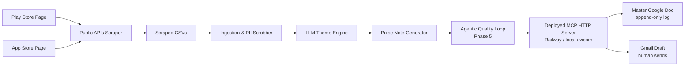
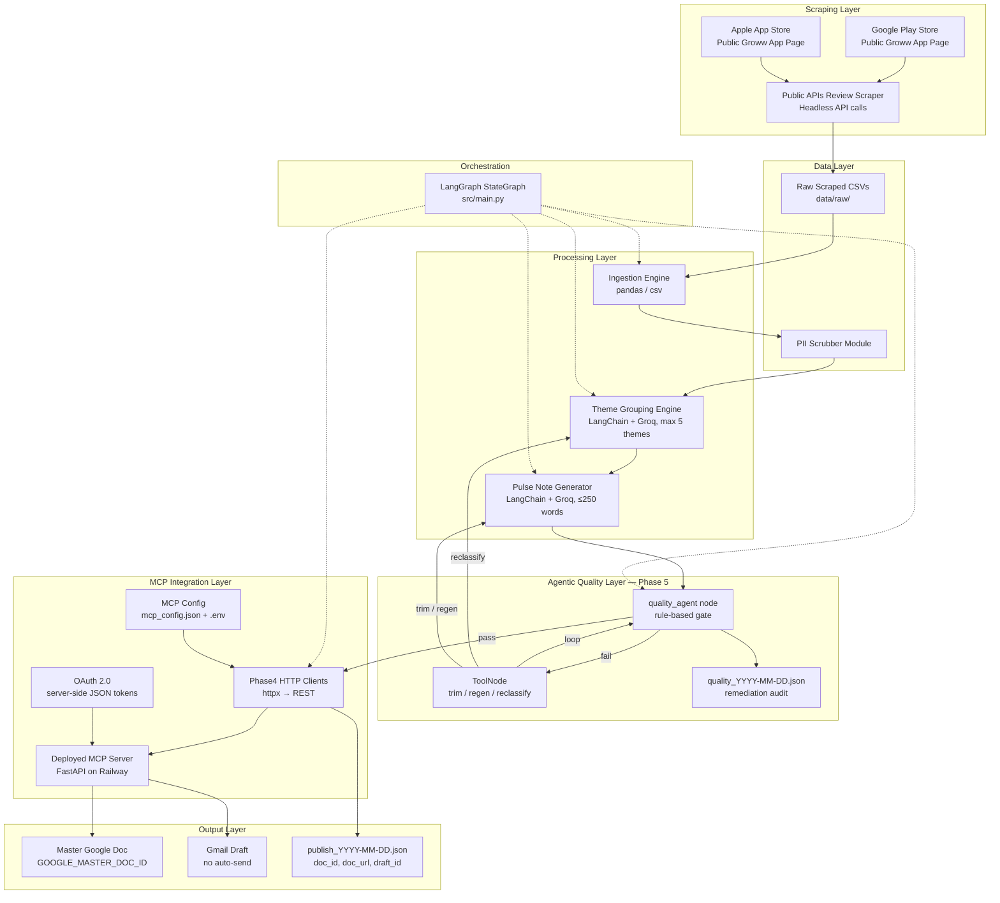
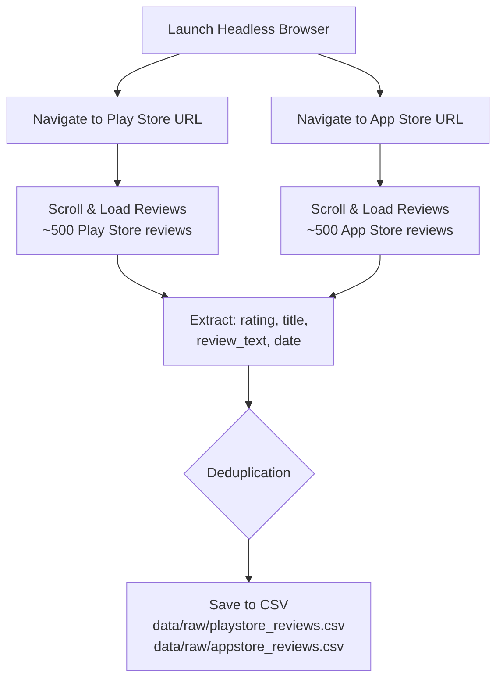
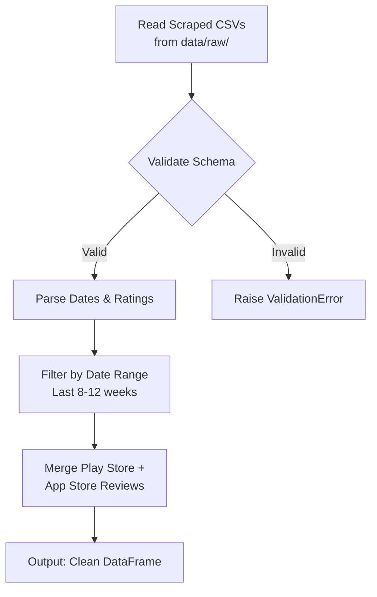
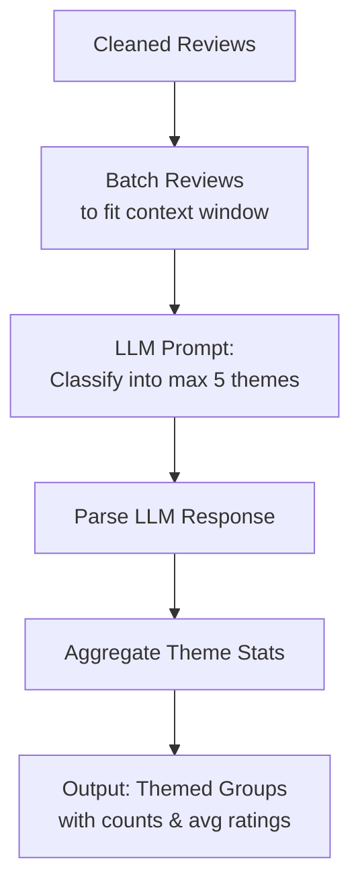
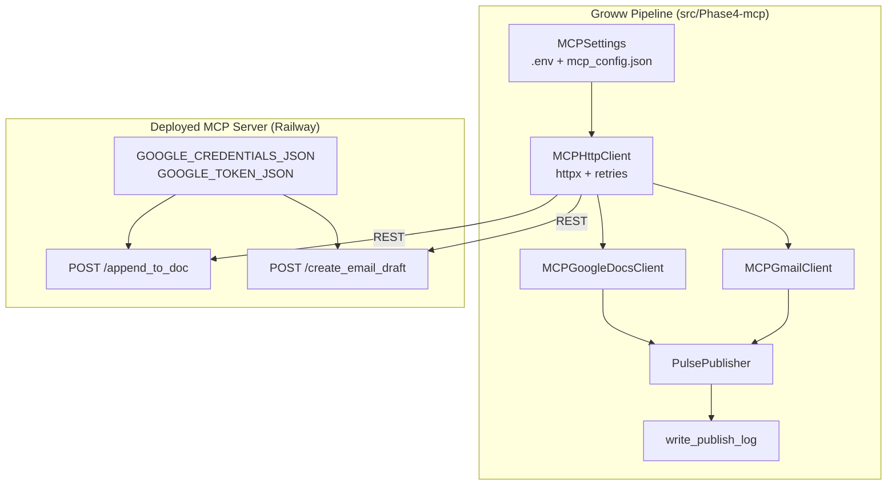
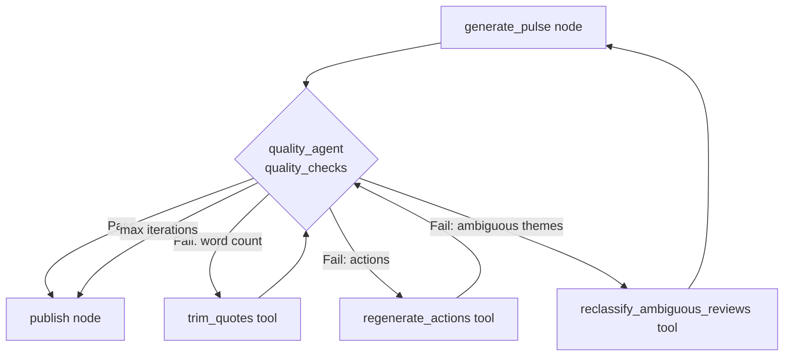
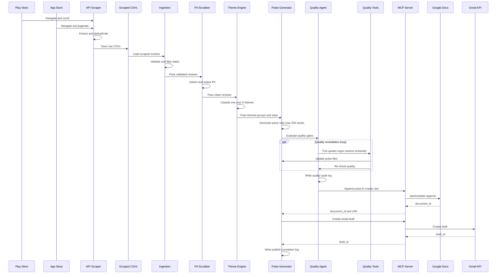
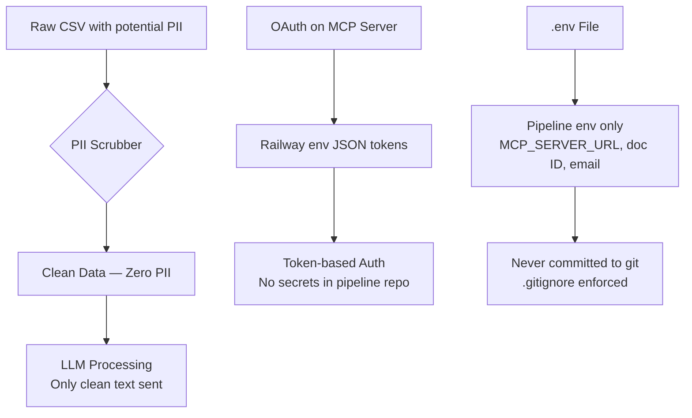

# Groww — Automated Weekly Product Review Pulse: Architecture

> **Version:** 1.1  
> **Date:** 2026-05-16  
> **Status:** Draft — Phases 5 implemented 

---

## 1. System Overview

This system is an **AI-powered agentic automation agent** that transforms raw Groww app reviews into a concise weekly pulse note, automatically **appended to a master Google Doc** with a Gmail draft ready for team distribution. The agent uses a **custom Model Context Protocol (MCP) server** for all Google Workspace interactions (Google Docs append + Gmail draft only), eliminating direct API coupling from the pipeline code.



---

## 2. High-Level Architecture

### 2.1 Architecture Diagram



### 2.2 Design Principles

| Principle | Description |
|---|---|
| **Scrape-First Ingestion** | Reviews are scraped live from public store pages via Public APIs — no manual CSV exports |
| **MCP-First Integration** | All Google Workspace interactions go through the deployed MCP HTTP API — no Google API calls in pipeline code |
| **Privacy by Design** | PII is stripped at the earliest stage; no identifiable data enters the LLM |
| **Append-Only Master Doc** | Each run appends a dated section to one configured Google Doc (see DEC-011); Gmail drafts are human-reviewed before send |
| **Scannable Output** | The pulse note is ≤250 words, structured for quick consumption |
| **Agentic Quality Gate** | A bounded self-correction loop (Phase 5) fixes word count, actions, and theme ambiguity before publish |
| **Human-in-the-Loop** | Gmail drafts are never auto-sent; a human reviews and sends |
| **No Login Scraping** | Only publicly visible review pages are accessed — zero authentication required |
| **LangGraph Orchestration** | Single `StateGraph` in `main.py` wires all phases; CSV-on-disk for resumability between nodes |

---

## 3. Component Architecture

### 3.0 Reviews Scraper Module

**Purpose:** Automatically scrape reviews from the public-facing Groww app listing pages on Google Play Store and Apple App Store using Public APIs API queries.



**Target URLs (public, no login required):**
- **Play Store:** `https://play.google.com/store/apps/details?id=com.nextbillion.groww`
- **App Store:** `https://apps.apple.com/in/app/groww-stocks-mutual-fund/id1404871703` (ratings page)

**Responsibilities:**
- Launch a headless Chromium browser via Public APIs
- Navigate to the public Groww app page on each store
- Scroll/paginate to load up to ~500 reviews per store (or 8–12 weeks of reviews)
- Extract structured data per review: `rating`, `title`, `review_text`, `date`, `source`
- Handle anti-bot mitigations gracefully (delays, random scroll speeds)
- Deduplicate reviews across runs
- Save scraped reviews as CSVs in `data/raw/`
- **Never access login-gated pages** — only public review listings

**Key Interfaces:**
```python
class PlayStoreScraper:
    async def scrape(self, app_id: str, max_reviews: int = 500) -> pd.DataFrame
    async def scroll_and_load(self, page, target_count: int) -> None
    def extract_reviews(self, page_content: str) -> list[dict]
    def save_to_csv(self, df: pd.DataFrame, output_path: str) -> None

class AppStoreScraper:
    async def scrape(self, app_id: str, max_reviews: int = 500) -> pd.DataFrame
    async def paginate_reviews(self, page, target_count: int) -> None
    def extract_reviews(self, page_content: str) -> list[dict]
    def save_to_csv(self, df: pd.DataFrame, output_path: str) -> None

class ReviewScraperOrchestrator:
    async def scrape_all(self) -> pd.DataFrame  # Combines Play Store + App Store
    def merge_and_deduplicate(self, dfs: list[pd.DataFrame]) -> pd.DataFrame
```

**Anti-Bot Considerations:**
- Random delays between scrolls (1–3 seconds)
- Realistic User-Agent headers
- Headless mode with stealth settings
- Rate limiting to avoid IP blocks

---

### 3.1 Data Ingestion Module

**Purpose:** Load and validate scraped review CSVs from `data/raw/`.



**Responsibilities:**
- Read CSV files generated by the Public APIs scraper from `data/raw/`
- Validate required columns: `rating` (1–5), `title`, `review_text`, `date`, `source`
- Filter reviews to the target date range (last 8–12 weeks)
- Filter short reviews and Keep only review text with word count ≥ 5; 
  remove reviews with < 5 words 
- Remove all emojis and exclude reviews written in languages other 
  than English. Keep only English-language reviews
- Merge Play Store and App Store reviews into a single DataFrame
- Handle missing/malformed rows gracefully

**Key Interfaces:**
```python
class ReviewIngestion:
    def load_scraped_csvs(self, raw_dir: str = "data/raw/") -> pd.DataFrame
    def load_csv(self, filepath: str) -> pd.DataFrame
    def validate_schema(self, df: pd.DataFrame) -> bool
    def filter_date_range(self, df: pd.DataFrame, weeks: int = 12) -> pd.DataFrame
    def merge_sources(self, dfs: list[pd.DataFrame]) -> pd.DataFrame
```

---

### 3.2 PII Scrubber Module

**Purpose:** Remove all personally identifiable information before any LLM processing.

**Responsibilities:**
- Detect and redact: usernames, email addresses, phone numbers, device IDs, IP addresses
- Use regex patterns + optional NER model for robust detection
- Log scrubbing statistics (count of redactions) without logging the PII itself
- Produce a clean, safe-to-process dataset

**Key Interfaces:**
```python
class PIIScrubber:
    def scrub_text(self, text: str) -> str
    def scrub_dataframe(self, df: pd.DataFrame, columns: list[str]) -> pd.DataFrame
    def get_scrub_report(self) -> dict
```

**PII Patterns Detected:**

| Pattern | Regex / Method | Replacement |
|---|---|---|
| Email | `[\w.-]+@[\w.-]+\.\w+` | `[EMAIL_REDACTED]` |
| Phone | `\+?\d[\d\s\-()]{7,}` | `[PHONE_REDACTED]` |
| Username | `@\w+` | `[USER_REDACTED]` |
| Device ID | UUID / IMEI patterns | `[DEVICE_REDACTED]` |

---

### 3.3 Theme Grouping Engine (LLM-Powered)

**Purpose:** Cluster reviews into a maximum of 5 actionable themes using an LLM.



**Suggested Themes:** `Onboarding`, `KYC`, `Payments`, `Statements`, `Withdrawals`

**Responsibilities:**
- Send batched reviews to the LLM with a structured classification prompt
- Parse LLM output into theme assignments
- Calculate per-theme: review count, average rating, sentiment signal
- Handle LLM rate limits and failures with retries

**Key Interfaces:**
```python
class ThemeGrouper:
    def group_reviews(self, reviews: list[dict]) -> dict[str, ThemeGroup]
    def build_prompt(self, reviews: list[dict]) -> str
    def parse_response(self, llm_output: str) -> dict
```

---

### 3.4 Pulse Note Generator (LLM-Powered)

**Purpose:** Produce a ≤250 word, scannable weekly pulse note from themed review data.

**Output Structure:**
```
# Groww Weekly Pulse — Week of <date>

## Top 3 Themes
1. **<Theme>** — <count> reviews, <avg_rating>★, <sentiment>
2. ...
3. ...

## User Voices (3 Verbatim Quotes)
> "<quote 1>" — <rating>★
> "<quote 2>" — <rating>★
> "<quote 3>" — <rating>★

## Recommended Actions
1. <Action 1>
2. <Action 2>
3. <Action 3>
```

**Responsibilities:**
- Select top 3 themes by volume/severity
- Pick 3 representative, PII-free verbatim quotes
- Generate 3 concrete, prioritized action recommendations
- Enforce the ≤250 word limit
- Format for both Google Docs and email readability

**Key Interfaces:**
```python
class PulseNoteGenerator:
    def generate(self, themes: dict, date_range: tuple) -> PulseNote
    def format_for_docs(self, note: PulseNote) -> str
    def format_for_email(self, note: PulseNote) -> str
    def validate_word_count(self, note: PulseNote) -> bool
```

---

### 3.5 MCP Integration Layer (Phase 4)

**Purpose:** Publish the pulse note via a **deployed MCP HTTP server** ([MCP-SERVER](https://github.com/shiv5084/MCP-SERVER) on Railway, or local `uvicorn` for dev). This repo implements **HTTP clients only** — append to a fixed master Google Doc and create a Gmail draft (never send). No Google Drive MCP.



**REST endpoints (MCP server):**

| Method | Path | Body | Response |
|---|---|---|---|
| `GET` | `/` | — | Health check |
| `GET` | `/tools` | — | Tool list |
| `POST` | `/append_to_doc` | `{ doc_id, content }` | `{ status, document_id, ... }` |
| `POST` | `/create_email_draft` | `{ to, subject, body }` | `{ status, draft_id, ... }` |

**Responsibilities (pipeline):**
- Load `MCP_SERVER_URL`, `GOOGLE_MASTER_DOC_ID`, `PULSE_EMAIL_*` from `.env` via `MCPSettings.load()`
- Health-check MCP server before publish
- **Append** pulse Markdown (dated section header) to `GOOGLE_MASTER_DOC_ID`
- Create Gmail draft with plain-text body + master doc URL — **never send**
- Write `output/logs/publish_YYYY-MM-DD.json` (`PublishResult` + `logged_at`)
- On failure: retain Phase 3 artifacts; operator re-runs `run_phase4.py` or full pipeline

**Entry points:**
- **Standalone:** `src/scripts/run_phase4.py`
- **LangGraph:** `publish` node in `src/main.py` (skipped when `--dry-run`)

**Key Interfaces:**
```python
class MCPHttpClient:
    def health_check(self) -> dict
    def post_tool(self, path: str, payload: dict) -> dict

class PulsePublisher:
    def publish(
        self, pulse_md_path: Path, pulse_txt_path: Path | None = None
    ) -> tuple[PublishResult, Path]

@dataclass
class PublishResult:
    document_id: str
    document_url: str
    draft_id: str
    run_timestamp: str
    week_label: str
    pulse_md_path: str | None
    pulse_txt_path: str | None
```

---

### 3.6 Agentic Quality Loop (Phase 5)

**Purpose:** Self-correcting quality gate **between pulse generation and publish**. Validates the pulse note against product rules; on failure, invokes LangChain `@tool` wrappers that reuse Phase 2–3 logic (no duplicate LLM clients). Implements [agenticUseCase.md — Step 3](agenticUseCase.md#step-3--agentic-quality-loop-phase-5).



**Pass criteria (pure rules — no LLM in the gate):**

| Check | Rule |
|---|---|
| Word count | Formatted pulse Markdown ≤ 250 words (configurable) |
| Themes | Top 3 themes present in `pulse_note_data` |
| Actions | Exactly 3 recommended actions |
| Ambiguity | Fallback-theme share ≤ 40%; optional reclassify on flagged review IDs |

**Remediation tools (`src/Phase5-agenticQuality/tools.py`):**

| Tool | When used | Effect |
|---|---|---|
| `check_word_count` | Diagnostics / tests | Returns `{count, within_limit}` |
| `trim_quotes` | Over word limit | Shortens quotes via `PulseNoteGenerator._enforce_word_limit`; rewrites md/txt/html |
| `regenerate_actions` | ≠ 3 actions | Re-invokes LangChain action chain with optional feedback |
| `reclassify_ambiguous_reviews` | Ambiguous clustering | Re-runs `ThemeGrouper` on flagged rows; full regroup → `theme_groups.json` |

**LangGraph wiring (`src/main.py`):**

```
… → generate_pulse → quality_agent ⇄ tools → tools_result → (quality_agent | generate_pulse)
                              ↓ pass
                    quality_resolve → publish (or END if --dry-run)
```

- **`quality_agent`** — rule-based node; emits `AIMessage` with `tool_calls` for `ToolNode` when remediation is needed.
- **`tools`** — `ToolNode` from `langgraph.prebuilt`; tools receive full pipeline state via `InjectedState`.
- **`tools_result`** — merges tool JSON output into `PipelineState` (`pulse_note_data`, `quality_iterations`, `post_tool_route`).
- **Loop guards** — `max_quality_iterations` (default 3, CLI `--max-quality-iterations`); on exhaustion, proceeds with warnings in `errors` and quality log.
- **`--skip-quality`** — bypasses the loop (generate_pulse → publish path via immediate pass).
- **`--dry-run`** — quality loop still runs; `publish` is skipped (END after `quality_resolve`).

**Entry points:**

- **LangGraph:** `quality_agent` + `tools` nodes in `src/main.py` (always after `generate_pulse`).
- **Standalone:** `src/scripts/run_phase5.py` — same `run_quality_loop()` as the graph; optional `--check-only`.

**Artifacts:**

| Path | Content |
|---|---|
| `output/notes/pulse_YYYY-MM-DD.{md,txt,html}` | Updated pulse after remediation |
| `output/notes/pulse_YYYY-MM-DD.json` | Optional `pulse_note_data` sidecar (written by `run_phase5.py`) |
| `output/logs/quality_YYYY-MM-DD.json` | Remediation audit (append-only list per run) |

**Key interfaces:**
```python
def evaluate_quality(
    *,
    pulse_md_path: str | None,
    pulse_note_data: dict | None,
    themes_json_path: str | None,
    word_limit: int = 250,
) -> QualityReport

def run_quality_loop(
    state: dict,
    *,
    regenerate_pulse: Callable[[dict], dict] | None = None,
) -> tuple[dict, bool, QualityReport]

# LangChain @tools
check_word_count(note_text: str, limit: int = 250) -> dict
trim_quotes(state: InjectedState) -> dict
regenerate_actions(theme_summary: str, feedback: str, state: InjectedState) -> dict
reclassify_ambiguous_reviews(review_ids: list[int], hint: str, state: InjectedState) -> dict
```

---

### 3.7 LangGraph Pipeline Orchestrator (`src/main.py`)

**Purpose:** Single entry point for the full agentic pipeline (Step 2 + Step 3 of [agenticUseCase.md](agenticUseCase.md)). Replaces disconnected per-phase CLIs for end-to-end runs.

**`PipelineState` (CSV-on-disk):** File paths and metadata flow between nodes — DataFrames are not held in memory (resumability). Phase 5 adds `messages`, `pulse_note_data`, `quality_*` fields, and `post_tool_route`.

**Node sequence:**

| Node | Phase | Output paths / keys |
|---|---|---|
| `scrape` | 1A | `raw_csv` → `data/raw/combined_reviews.csv` |
| `ingest` | 1 | (temp) `_ingested_reviews.csv` |
| `pii_scrub` | 1 | `cleaned_csv` → `data/cleaned/cleaned_reviews.csv` |
| `classify_themes` | 2 | `themes_json` → `output/notes/theme_groups.json` |
| `generate_pulse` | 3 | `pulse_md`, `pulse_txt`, `pulse_html`, `pulse_note_data` |
| `quality_agent` | 5 | quality status / tool calls |
| `tools` | 5 | remediation side effects |
| `publish` | 4 | `doc_id`, `doc_url`, `draft_id`, `publish_log` |

**Conditional entry:** `--scrape` → `scrape` first; else → `ingest`.

---

## 4. Data Flow



---

## 5. Technology Stack

| Layer | Technology | Rationale |
|---|---|---|
| **Language** | Python 3.11+ | Rich ecosystem for data processing & LLM integration |
| **Review Scraping** | Public APIs | Headless API calls for scraping public Play Store & App Store reviews |
| **Data Processing** | pandas | Industry standard for CSV handling and data manipulation |
| **LLM Provider** | Groq via LangChain (`langchain-groq`) | Theme + action chains with `.with_retry()`; raw Groq SDK kept as fallback |
| **Orchestration** | LangGraph (`langgraph`) | `StateGraph` in `main.py`; conditional scrape / dry-run / quality loop |
| **Agent tools** | LangChain `@tool` + `ToolNode` | Phase 5 remediation; `InjectedState` for pipeline context |
| **MCP transport** | `httpx` REST client (`src/Phase4-mcp/`) | Calls deployed FastAPI MCP server; retries + timeouts from `mcp_config.json` |
| **MCP server** | [MCP-SERVER](https://github.com/shiv5084/MCP-SERVER) on Railway | Hosts Google Docs + Gmail tools; OAuth in server env |
| **Google Docs** | MCP `POST /append_to_doc` | Docs API `batchUpdate` append to `GOOGLE_MASTER_DOC_ID` |
| **Gmail** | MCP `POST /create_email_draft` | Gmail API `drafts.create` only — no send |
| **Auth** | OAuth 2.0 on MCP server | `GOOGLE_CREDENTIALS_JSON` + `GOOGLE_TOKEN_JSON` on Railway; pipeline uses URL only |
| **PII Detection** | Regex + spaCy (optional) | Fast pattern matching with optional NER enhancement |
| **Testing** | pytest | Standard Python testing framework |
| **Scheduling** | GitHub Actions (optional) | Cron-based weekly automation |

---

## 6. Security Architecture



**Security Principles:**
1. **PII stripped before LLM** — No identifiable data ever reaches the LLM
2. **OAuth 2.0 only** — No hardcoded Google credentials
3. **Secrets in .env** — All API keys and tokens loaded from environment
4. **No auto-send** — Gmail drafts require human approval before sending
5. **.gitignore enforced** — Credentials, tokens, and .env files never in version control

---

## 7. Error Handling Strategy

| Error Type | Handling | Recovery |
|---|---|---|
| CSV schema mismatch | `ValidationError` with clear message | Fix CSV and re-run |
| PII detection failure | Log warning, continue with regex-only | Manual review of flagged rows |
| LLM rate limit | Exponential backoff, max 3 retries | Queue and retry after cooldown |
| LLM response parse error | Fallback to regex-based parsing | Log raw response for debugging |
| MCP server connection failure | Retry with timeout | Fall back to local file output |
| OAuth token expiry | Auto-refresh via MCP server | Re-authenticate if refresh fails |
| Google Doc append failure | Retry once, then save locally | Output as local Markdown file; log doc_id for debugging |
| Gmail draft failure | Retry once, then log content | Output email content to console |
| Quality gate failure | Invoke remediation tool; increment `quality_iterations` | Loop until pass or `max_quality_iterations` |
| Quality max iterations | Log warnings; optional force proceed in graph | Review `quality_YYYY-MM-DD.json`; fix pulse manually or re-run Phase 5 |
| Reclassify tool failure | Log error in tool result | Re-run Phase 2 or `run_phase5.py` with `--themes` |

---

## 8. Directory Structure (Final State)

```
Groww-Automated-Weekly-Product-Review-Pulse/
├── doc/
│   ├── problemStatement.md
│   ├── architecture.md              # This file
│   ├── phase-wise-implementationplan.md      # Phase-wise implementation plan
│   ├── eval.md                      # Evaluation criteria per phase
│   ├── decision.md                  # Tech & business decisions log
│   └── prompt.md                    # Prompt log
├── src/
│   ├── __init__.py
│   ├── main.py                      # LangGraph pipeline (Phases 1A–5 + publish)
│   ├── Phase1A-scraper/
│   │   ├── __init__.py
│   │   ├── playstore_scraper.py     # Play Store review scraper (Public APIs)
│   │   ├── appstore_scraper.py      # App Store review scraper (Public APIs)
│   │   └── orchestrator.py          # Scraper orchestrator (merge + dedup)
│   ├── Phase1-ingestion/
│   │   ├── __init__.py
│   │   ├── csv_loader.py            # CSV loading & validation
│   │   └── date_filter.py           # Date range filtering
│   ├── Phase1-pii/
│   │   ├── __init__.py
│   │   ├── scrubber.py              # PII detection & redaction
│   │   └── patterns.py              # Regex patterns for PII
│   ├── Phase2-themes/
│   │   ├── __init__.py
│   │   ├── grouper.py               # LLM-powered theme classification
│   │   └── prompts.py               # LLM prompt templates
│   ├── Phase3-generator/
│   │   ├── __init__.py
│   │   ├── pulse_note.py            # Pulse note generation
│   │   └── formatter.py             # Output formatting (Docs/Email)
│   ├── Phase4-mcp/                  # Phase 4 — HTTP clients to deployed MCP server
│   │   ├── __init__.py
│   │   ├── config.py                # MCPSettings loader (.env + mcp_config.json)
│   │   ├── mcp_http_client.py       # httpx REST client (retries, health check)
│   │   ├── google_docs_client.py    # POST /append_to_doc
│   │   ├── gmail_client.py          # POST /create_email_draft
│   │   ├── publisher.py             # PulsePublisher orchestration
│   │   ├── publish_result.py        # PublishResult + correlation log writer
│   │   └── exceptions.py            # ConfigurationError, MCPError
│   ├── Phase5-agenticQuality/       # Phase 5 — agentic quality loop
│   │   ├── __init__.py
│   │   ├── quality_checks.py        # Pure pass/fail rules (no LLM)
│   │   ├── tools.py                 # @tool: check_word_count, trim, regen, reclassify
│   │   └── quality_agent.py         # quality_agent_node, run_quality_loop, routing
│   └── scripts/
│       ├── run_scraper.py           # Phase 1A CLI
│       ├── run_phase1.py            # Phase 1 CLI
│       ├── run_phase2.py            # Phase 2 CLI
│       ├── run_phase3.py            # Phase 3 CLI
│       ├── run_phase4.py            # Phase 4 CLI — publish to Doc + Gmail draft
│       └── run_phase5.py            # Phase 5 CLI — quality loop on existing pulse
├── data/
│   ├── raw/                         # Scraped CSVs from Public APIs (gitignored)
│   │   ├── playstore_reviews.csv    # Auto-generated by scraper
│   │   └── appstore_reviews.csv     # Auto-generated by scraper
│   ├── cleaned/                     # PII-scrubbed data
│   └── sample/
│       └── sample_reviews.csv       # Sample/demo data (committed)
├── output/
│   ├── notes/                       # Generated pulse notes (Markdown)
│   └── logs/                        # publish_ + quality_ YYYY-MM-DD.json logs
├── tests/
│   ├── __init__.py
│   ├── test_scraper.py              # Tests for Public APIs scrapers
│   ├── test_ingestion.py
│   ├── test_pii_scrubber.py
│   ├── test_theme_grouper.py
│   ├── test_pulse_generator.py
│   ├── test_mcp_integration.py
│   ├── test_quality_tools.py        # Phase 5 tool + quality_checks tests
│   └── test_quality_loop.py         # Phase 5 agent routing + graph wiring
├── config/
│   ├── mcp_config.json              # MCP server URL, endpoints, timeout/retry settings
│   ├── mcp_config.example.json      # Safe template for mcp_config.json
│   └── themes.yaml                  # Theme definitions
├── .env.example                     # Environment variable template
├── .gitignore
├── requirements.txt
├── api.config.py             # Public APIs browser configuration
└── README.md
```

---

## 9. Deployment & Execution

### Local Execution
```bash
# 1. Setup
python -m venv venv && source venv/bin/activate
pip install -r requirements.txt
api install chromium  # Install Public APIs browser
cp .env.example .env  # Fill in API keys & OAuth config

# 2. Scrape reviews (Public APIs)
python src/main.py --scrape --weeks 12

# 3. Run full LangGraph pipeline (ingest → quality loop → publish via Railway MCP)
langgraph_env\Scripts\python.exe src/main.py --csv data/raw --weeks 12

# 4. Dry-run (quality loop runs; publish skipped)
langgraph_env\Scripts\python.exe src/main.py --csv data/raw --weeks 12 --dry-run

# 5. Skip quality loop (not recommended for production)
langgraph_env\Scripts\python.exe src/main.py --csv data/raw --weeks 12 --skip-quality

# 6. Per-phase CLIs (debug / partial runs)
python src/scripts/run_phase3.py
python src/scripts/run_phase5.py              # quality gate on latest pulse
python src/scripts/run_phase5.py --check-only # evaluate only, no remediation
python src/scripts/run_phase4.py --verbose    # publish after quality pass
```

**Recommended manual sequence (matches graph order):**

```
Phase 3  →  Phase 5  →  Phase 4
run_phase3.py  →  run_phase5.py  →  run_phase4.py
```

Or a single graph run: `src/main.py` (includes Phase 5 between generate and publish).

### Automated (GitHub Actions)
```yaml
# .github/workflows/weekly-pulse.yml
name: Weekly Pulse Generation
on:
  schedule:
    - cron: '0 9 * * 1'  # Every Monday at 9 AM UTC
  workflow_dispatch:       # Manual trigger

jobs:
  generate-pulse:
    runs-on: ubuntu-latest
    steps:
      - uses: actions/checkout@v4
      - uses: actions/setup-python@v5
        with:
          python-version: '3.11'
      - run: pip install -r requirements.txt
      - run: api install chromium --with-deps
      - run: python src/main.py --scrape --weeks 12
        env:
          LLM_API_KEY: ${{ secrets.LLM_API_KEY }}
          GOOGLE_OAUTH_TOKEN: ${{ secrets.GOOGLE_OAUTH_TOKEN }}
```
