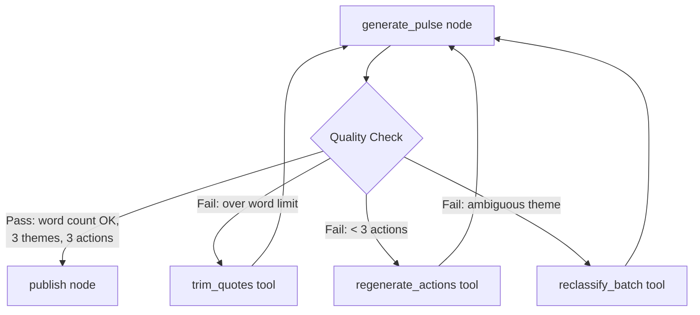
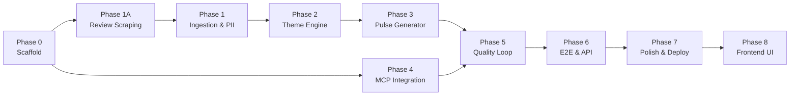

# Groww — Automated Weekly Product Review Pulse: Implementation Plan

> **Version:** 1.0  
> **Date:** 2026-05-13  
> **Total Phases:** 8 (Phase 0–6, with Phase 1A)  
> **Estimated Duration:** 6–7 weeks

---

## Phase Overview

| Phase | Name | Duration | Key Deliverable |
|---|---|---|---|
| **Phase 0** | Project Scaffold & Environment Setup | 2 days | Runnable project skeleton with all configs |
| **Phase 1A** | Review Scraping | 3 days | Scraped Play Store + App Store reviews as CSVs |
| **Phase 1** | Data Ingestion & PII Scrubbing | 3 days | Clean, validated, PII-free review dataset |
| **Phase 2** | LLM Theme Grouping Engine | 3 days | Reviews classified into ≤5 themes with stats |
| **Phase 3** | Pulse Note Generation | 2 days | ≤250 word weekly pulse note in Markdown |
| **Phase 4** | MCP Server Integration (Google Docs + Gmail) | 4 days | Append to master Google Doc + Gmail draft (no send) |
| **Phase 5** | Agentic Quality Loop | 3 days | Self-correcting pulse quality gate before publish |
| **Phase 6** | End-to-End Pipeline, Polish & Deployment | 3 days | Production-ready pipeline with CI/CD |

---

## Phase 0 — Project Scaffold & Environment Setup

### Objective
Set up the complete project skeleton, dependency management, configuration system, and development tooling so all subsequent phases can build on a solid foundation.

### Tasks

| # | Task | Description | Priority |
|---|---|---|---|
| 0.1 | Initialize project structure | Create all directories and `__init__.py` files | 🔴 Critical |
| 0.2 | Set up Python virtual environment | Python 3.11+, venv, pip | 🔴 Critical |
| 0.3 | Create `requirements.txt` | All dependencies with pinned versions | 🔴 Critical |
| 0.4 | Create `.env.example` | Template for all required environment variables | 🔴 Critical |
| 0.5 | Create `.gitignore` | Exclude venv, .env, __pycache__, data/raw/, credentials | 🔴 Critical |
| 0.6 | Set up MCP config skeleton | `config/mcp_config.json` + `mcp_config.example.json` for custom `groww-pulse-mcp` | 🟡 High |
| 0.7 | Create theme definitions | `config/themes.yaml` with 5 default themes | 🟡 High |
| 0.8 | Create sample reviews CSV | `data/sample/sample_reviews.csv` with 20–30 mock reviews | 🟡 High |
| 0.9 | Set up pytest configuration | `pytest.ini` or `pyproject.toml` test config | 🟢 Medium |
| 0.10 | Create README skeleton | Basic README with project overview and setup instructions | 🟢 Medium |

### Files Created

```
Groww-Automated-Weekly-Product-Review-Pulse/
├── src/
│   ├── __init__.py
│   ├── main.py                          # Entry point stub
│   ├── Phase1A-scraper/
│   │   └── __init__.py                  # Scraper module placeholder
│   ├── Phase1-ingestion/
│   │   └── __init__.py
│   ├── Phase1-pii/
│   │   └── __init__.py
│   ├── Phase2-themes/
│   │   └── __init__.py
│   ├── Phase3-generator/
│   │   └── __init__.py
│   └── Phase4-mcp/
│       └── __init__.py
├── data/
│   ├── raw/                             # (empty, gitignored — scraped CSVs go here)
│   ├── cleaned/                         # (empty)
│   └── sample/
│       └── sample_reviews.csv           # 20-30 mock reviews
├── output/
│   ├── notes/                           # (empty)
│   └── logs/                            # (empty)
├── tests/
│   └── __init__.py
├── config/
│   ├── mcp_config.json                  # MCP server config skeleton
│   └── themes.yaml                      # Default theme definitions
├── .env.example                         # Environment variable template
├── .gitignore                           # Comprehensive gitignore
├── requirements.txt                     # Pinned dependencies
├── pytest.ini                           # Test configuration
└── README.md                            # Project README skeleton
```

### Exit Criteria
→ See [eval.md — Phase 0](eval.md#phase-0--project-scaffold--environment-setup)

---

## Phase 1A — Review Scraping

### Objective
Automate the collection of Groww app reviews from the **public** Google Play Store and Apple App Store pages using public APIs (`google-play-scraper` and `iTunes RSS`). Scraped reviews are saved as structured CSVs — **no manually exported CSVs**.

### Tasks

| # | Task | Description | Priority |
|---|---|---|---|
| 1A.1 | Install API clients | `pip install google-play-scraper requests` | 🔴 Critical |
| 1A.2 | Play Store scraper | Fetch reviews directly via `google-play-scraper` | 🔴 Critical |
| 1A.3 | App Store scraper | Fetch reviews directly via Apple's iTunes RSS API | 🔴 Critical |
| 1A.4 | Review data extraction | Parse: rating, title, review_text, date, source per review | 🔴 Critical |
| 1A.5 | Rate limiting | Random delays (1–3s) between pagination requests | 🟡 High |
| 1A.6 | Scraper orchestrator | Combine Play Store + App Store, deduplicate, merge into CSV | 🔴 Critical |
| 1A.7 | Save to CSV | Output to `data/raw/playstore_reviews.csv` and `data/raw/appstore_reviews.csv` | 🔴 Critical |
| 1A.8 | Configurable limits | Max reviews per store (~500), date range (8–12 weeks) | 🟡 High |
| 1A.9 | Error handling | Handle page load failures, empty results, network timeouts | 🟡 High |
| 1A.10 | Write unit tests | Mock API JSON responses, test extraction and deduplication logic | 🔴 Critical |

### Files Created

```
Groww-Automated-Weekly-Product-Review-Pulse/
├── src/
│   └── Phase1A-scraper/
│       ├── __init__.py                  # (updated with imports)
│       ├── playstore_scraper.py         # Play Store API scraper
│       ├── appstore_scraper.py          # App Store API scraper
│       └── orchestrator.py              # Scraper orchestrator (merge + dedup)
├── data/
│   └── raw/
│       ├── playstore_reviews.csv        # Auto-generated by Play Store scraper
│       └── appstore_reviews.csv         # Auto-generated by App Store scraper
├── tests/
│   └── test_scraper.py                  # Tests for API scrapers
```

### Dependencies Introduced
- `google-play-scraper` — Fetching Play Store reviews
- `requests` — Fetching iTunes RSS JSON

### Key Constraints
- **No login-gated pages** — only publicly visible review listings
- **Public URLs only:**
  - Play Store: `https://play.google.com/store/apps/details?id=com.nextbillion.groww`
  - App Store: `https://apps.apple.com/in/app/groww-stocks-mutual-fund/id1404871703`
- Rate limiting to respect public API constraints

### Exit Criteria
→ See [eval.md — Phase 1A](eval.md#phase-1a--review-scraping)

---

## Phase 1 — Data Ingestion & PII Scrubbing

### Objective
Build a robust ingestion pipeline that loads scraped review CSVs from `data/raw/`, validates the data, and strips all PII before any downstream processing.

### Tasks
 
| # | Task | Description | Priority |
|---|---|---|---|
| 1.1 | Implement CSV loader | Load CSV with pandas, handle encoding issues | 🔴 Critical |
| 1.2 | Schema validation | Validate required columns: rating, title, review_text, date | 🔴 Critical |
| 1.3 | Date range filtering | Filter reviews to last 8–12 weeks (configurable) | 🔴 Critical |
| 1.4 | Build PII regex patterns | Email, phone, username, device ID patterns | 🔴 Critical |
| 1.5 | Filter short reviews | Keep only review text with word count ≥ 5; remove reviews with < 5 words | 🔴 Critical |
|1.6|Remove emojis and and exclude reviews written in languages other than English | Remove all emojis and exclude reviews written in languages other than English. Keep only English-language reviews | 🔴 Critical |
| 1.7 | Implement PII scrubber | Apply regex patterns to review text and titles | 🔴 Critical |
| 1.8 | Scrub report generation | Log count of redactions per pattern type | 🟡 High |
| 1.9 | Handle edge cases | Empty CSVs, missing columns, malformed dates, UTF-8 issues | 🟡 High |
| 1.10 | Output cleaned dataset | Save scrubbed data to `data/cleaned/` | 🟢 Medium |
| 1.11 | Write unit tests | Tests for loader, validator, scrubber | 🔴 Critical |

### Files Created

```
Groww-Automated-Weekly-Product-Review-Pulse/
├── src/
│   ├── Phase1-ingestion/
│   │   ├── __init__.py                  # (updated with imports)
│   │   ├── csv_loader.py               # CSV loading & validation logic
│   │   └── date_filter.py              # Date range filtering utility
│   └── Phase1-pii/
│       ├── __init__.py                  # (updated with imports)
│       ├── scrubber.py                  # PII detection & redaction engine
│       └── patterns.py                  # Regex patterns for PII types
├── data/
│   └── cleaned/
│       └── .gitkeep                     # Placeholder for cleaned output
├── tests/
│   ├── test_ingestion.py               # Tests for CSV loader & date filter
│   └── test_pii_scrubber.py            # Tests for PII scrubber
└── (no new config files this phase)
```

### Dependencies Introduced
- `pandas` — DataFrame operations for CSV handling
- `python-dateutil` — Robust date parsing

### Exit Criteria
→ See [eval.md — Phase 1](eval.md#phase-1--data-ingestion--pii-scrubbing)

---

## Phase 2 — LLM Theme Grouping Engine

### Objective
Use an LLM to intelligently classify cleaned reviews into a maximum of 5 themes, with per-theme statistics (count, average rating, sentiment).

### Tasks

| # | Task | Description | Priority |
|---|---|---|---|
| 2.1 | Design classification prompt | Structured prompt for ≤5 theme classification | 🔴 Critical |
| 2.2 | Implement LLM client | Groq/OpenAI client with retry logic | 🔴 Critical |
| 2.3 | Build batching logic | Batch reviews to fit within LLM context window | 🔴 Critical |
| 2.4 | Parse LLM response | Extract theme assignments from LLM output (JSON) | 🔴 Critical |
| 2.5 | Aggregate theme statistics | Calculate count, avg rating, sentiment per theme | 🟡 High |
| 2.6 | Handle LLM failures | Exponential backoff, max 3 retries, fallback | 🟡 High |
| 2.7 | Prompt versioning | Store prompts in `src/themes/prompts.py` for iteration | 🟢 Medium |
| 2.8 | Write unit tests | Mock LLM responses, test parsing and aggregation | 🔴 Critical |

### Files Created

```
Groww-Automated-Weekly-Product-Review-Pulse/
├── src/
│   └── Phase2-themes/
│       ├── __init__.py                  # (updated with imports)
│       ├── grouper.py                   # Theme classification engine
│       └── prompts.py                   # LLM prompt templates (versioned)
├── tests/
│   └── test_theme_grouper.py           # Tests for theme grouper
└── (no new config files this phase)
```

### Dependencies Introduced
- `groq` or `openai` — LLM API client
- `tenacity` — Retry logic with exponential backoff

### Exit Criteria
→ See [eval.md — Phase 2](eval.md#phase-2--llm-theme-grouping-engine)

---

## Phase 3 — Pulse Note Generation

### Objective
Generate a ≤250 word, scannable weekly pulse note from the themed review data, formatted for both Google Docs and email consumption.

### Tasks

| # | Task | Description | Priority |
|---|---|---|---|
| 3.1 | Design pulse note template | Markdown template with top 3 themes, quotes, actions | 🔴 Critical |
| 3.2 | Implement quote selection | Select 3 representative, PII-free verbatim quotes | 🔴 Critical |
| 3.3 | Implement action generation | LLM-generated concrete action recommendations | 🔴 Critical |
| 3.4 | Word count enforcement | Validate ≤250 words, trim if needed | 🔴 Critical |
| 3.5 | Docs formatter | Format output for Google Docs (headings, bullets) | 🟡 High |
| 3.6 | Email formatter | Format output for email body (plain text + HTML) | 🟡 High |
| 3.7 | Date range labeling | Title format: `Groww Weekly Pulse — Week of <date>` | 🟢 Medium |
| 3.8 | Write unit tests | Test generation, formatting, word count validation | 🔴 Critical |

### Files Created

```
Groww-Automated-Weekly-Product-Review-Pulse/
├── src/
│   └── Phase3-generator/
│       ├── __init__.py                  # (updated with imports)
│       ├── pulse_note.py               # Pulse note generation logic
│       └── formatter.py                # Docs & email formatting
├── tests/
│   └── test_pulse_generator.py         # Tests for pulse generator
└── (no new config files this phase)
```

### Dependencies Introduced
- `jinja2` (optional) — Template rendering for note formatting

### Exit Criteria
→ See [eval.md — Phase 3](eval.md#phase-3--pulse-note-generation)

---

## Phase 4 — MCP Server Integration (Google Docs + Gmail)

### Objective
Publish each weekly pulse via a **deployed custom MCP HTTP server** ([MCP-SERVER](https://github.com/shiv5084/MCP-SERVER) on Railway): append formatted content to a **pre-configured master Google Doc** (fixed `GOOGLE_MASTER_DOC_ID`), capture `document_id` + `document_url` for logs and Gmail, and create a **Gmail draft only** (never auto-send). No Google Drive MCP and **no Google OAuth in this repo** — credentials live on the MCP server.

> Product choices: [decision.md — DEC-011, DEC-012, DEC-013, DEC-014](decision.md)

### Implementation Summary

| Area | What was built |
|---|---|
| **Transport** | `httpx` REST client (`MCPHttpClient`) → `GET /`, `POST /append_to_doc`, `POST /create_email_draft` |
| **Orchestration** | `PulsePublisher` coordinates health check → doc append → Gmail draft → correlation log |
| **CLI** | `src/scripts/run_phase4.py` — standalone publish (latest or `--input` pulse file) |
| **Pipeline** | LangGraph `publish` node in `src/main.py` (skipped when `--dry-run`) |
| **Config** | `config/mcp_config.json` + `.env`: `MCP_SERVER_URL`, `GOOGLE_MASTER_DOC_ID`, `PULSE_EMAIL_*` |
| **Server OAuth** | Railway env: `GOOGLE_CREDENTIALS_JSON`, `GOOGLE_TOKEN_JSON`, `AUTO_APPROVE=true` |
| **Tests** | `tests/test_mcp_integration.py` — mocked HTTP responses (5 tests) |

### Tasks

| # | Task | Description | Priority | Status |
|---|---|---|---|---|
| 4.1 | MCP HTTP client | `mcp_http_client.py` — retries, health check, tool error handling | 🔴 Critical | ✅ Done |
| 4.2 | OAuth on MCP server | Docs + Gmail OAuth on Railway (`GOOGLE_CREDENTIALS_JSON`, `GOOGLE_TOKEN_JSON`); not in pipeline `.env` | 🔴 Critical | ✅ Done |
| 4.3 | MCP config | `config/mcp_config.json` → `${MCP_SERVER_URL}` + timeout/retry settings | 🔴 Critical | ✅ Done |
| 4.4 | Master doc setup | `GOOGLE_MASTER_DOC_ID` in `.env`; operator creates doc once | 🔴 Critical | ✅ Done |
| 4.5 | Google Docs client | `google_docs_client.py` — `append_pulse_section()` with dated section header | 🔴 Critical | ✅ Done |
| 4.6 | Gmail client | `gmail_client.py` — `create_draft()`; body includes master doc URL; **no send** | 🔴 Critical | ✅ Done |
| 4.7 | Publish correlation log | `publish_result.py` → `output/logs/publish_YYYY-MM-DD.json` | 🔴 Critical | ✅ Done |
| 4.8 | Error handling | `exceptions.py` — `ConfigurationError`, `MCPError`, `MCPRejectedError` | 🟡 High | ✅ Done |
| 4.9 | Fallback to local output | On MCP fail: keep Phase 3 Markdown; `run_phase4.py` re-run message | 🟡 High | ✅ Done |
| 4.10 | `run_phase4.py` CLI | `--input`, `--txt`, `--notes-dir`, `--verbose` | 🔴 Critical | ✅ Done |
| 4.11 | Integration tests | `tests/test_mcp_integration.py` (mocked `httpx`) | 🔴 Critical | ✅ Done |
| 4.12 | Document MCP setup | README Phase 4 section + `.env.example` MCP vars | 🟢 Medium | ✅ Done |
| 4.13 | LangGraph `publish` node | `main.py` wires `PulsePublisher` after `generate_pulse` | 🔴 Critical | ✅ Done |

### Files Created

```
Groww-Automated-Weekly-Product-Review-Pulse/
├── src/
│   ├── Phase4-mcp/
│   │   ├── __init__.py
│   │   ├── config.py                    # MCP config loader + env validation
│   │   ├── mcp_http_client.py             # HTTP client → Railway MCP server
│   │   ├── google_docs_client.py        # POST /append_to_doc
│   │   ├── gmail_client.py              # POST /create_email_draft
│   │   ├── publisher.py                 # Orchestrates publish + correlation log
│   │   ├── publish_result.py            # PublishResult dataclass
│   │   └── exceptions.py
│   └── scripts/
│       └── run_phase4.py                # CLI: publish pulse to Doc + Gmail draft
├── config/
│   ├── mcp_config.json                  # Custom MCP server command + env
│   └── mcp_config.example.json          # Template (safe to commit)
├── output/
│   └── logs/
│       └── publish_YYYY-MM-DD.json      # Correlation artifact (gitignored)
├── tests/
│   └── test_mcp_integration.py
└── credentials/
    └── .gitkeep
```

### Dependencies Introduced (this repo)

| Package | Role in Phase 4 |
|---|---|
| `httpx` | HTTP client for Railway/local MCP REST API |
| `python-dotenv` | Load `MCP_SERVER_URL`, `GOOGLE_MASTER_DOC_ID`, `PULSE_EMAIL_*` |

OAuth and Google API client libraries are **not required in the pipeline** — they run on the MCP server ([MCP-SERVER](https://github.com/shiv5084/MCP-SERVER)). `mcp` remains in `requirements.txt` for protocol alignment; Phase 4 calls use HTTP only.

### Environment Variables (pipeline `.env`)

| Variable | Required | Purpose |
|---|---|---|
| `MCP_SERVER_URL` | Yes | Base URL (default: `https://mcp-server-production-5084.up.railway.app`) |
| `GOOGLE_MASTER_DOC_ID` | Yes | Fixed master Google Doc for append-only pulses |
| `PULSE_EMAIL_RECIPIENT` | Yes | Gmail draft recipient |
| `PULSE_EMAIL_SUBJECT_PREFIX` | No | Draft subject prefix (default: `Groww Weekly Pulse`) |
| `OUTPUT_LOGS_DIR` | No | Publish log directory (default: `output/logs`) |

### Environment Variables (Railway MCP server)

| Variable | Purpose |
|---|---|
| `GOOGLE_CREDENTIALS_JSON` | OAuth client JSON (written to `credentials.json` at startup) |
| `GOOGLE_TOKEN_JSON` | Refresh token + scopes for Docs + Gmail |
| `AUTO_APPROVE` | `true` — required for HTTP (no interactive approval prompt) |
| `PYTHON_VERSION` | Runtime pin for deployment |

### Usage

```bash
# Standalone Phase 4 (after Phase 3)
python src/scripts/run_phase4.py
python src/scripts/run_phase4.py --input output/notes/pulse_2026-05-16.md --verbose

# Full LangGraph pipeline (includes publish unless --dry-run)
langgraph_env\Scripts\python.exe src/main.py --csv data/raw --weeks 12
```

### Exit Criteria
→ See [eval.md — Phase 4](eval.md#phase-4--mcp-server-integration-google-docs--gmail)

**Verified:** End-to-end publish via Railway MCP (master doc append + Gmail draft + `publish_YYYY-MM-DD.json`); full `main.py` pipeline run with `publish` node.

---

## Phase 5 — Agentic Quality Loop

### Objective

Introduce a **self-correcting agent loop** between pulse generation and publish so the pipeline can fix common quality failures automatically — word count over limit, fewer than three actions, or ambiguous theme assignments — before content reaches Google Docs or Gmail. This implements [agenticUseCase.md — Migration Strategy, Step 3](agenticUseCase.md#step-3--agentic-quality-loop-phase-5) using LangGraph `ToolNode` and LangChain `@tool` wrappers around existing Phase 2–3 logic.

> **Prerequisites:** LangGraph `StateGraph` in `src/main.py` (Step 2) and LangChain chains in `grouper.py` / `pulse_note.py` (Step 1) per [agenticUseCase.md](agenticUseCase.md).

### Tasks

| # | Task | Description | Priority |
|---|---|---|---|
| 5.1 | Define quality gate rules | Pass criteria: note ≤250 words, top 3 themes present, exactly 3 actions; document failure → remediation mapping | 🔴 Critical |
| 5.2 | `check_word_count` tool | LangChain `@tool` — returns `{count, within_limit}` against configurable limit (default 250) | 🔴 Critical |
| 5.3 | `reclassify_ambiguous_reviews` tool | Re-run theme classification on a review-ID subset with an optional hint | 🔴 Critical |
| 5.4 | `regenerate_actions` tool | Re-invoke action LLM chain with `theme_summary` + feedback when &lt; 3 actions | 🔴 Critical |
| 5.5 | Quote trim helper | Trim or replace quotes when word count fails (feeds back into `generate_pulse`) | 🟡 High |
| 5.6 | `quality_agent` node | Agent node that evaluates `pulse_note` / `theme_groups` and selects tools or approves publish | 🔴 Critical |
| 5.7 | `ToolNode` + tool loop | `graph.add_node("tools", ToolNode(tools))`; `tools_condition` edges; loop back to `quality_agent` | 🔴 Critical |
| 5.8 | Graph wiring | Insert between `generate_pulse` and `publish`: `generate_pulse` → `quality_agent` ⇄ `tools` → `publish` (respect `--dry-run` skip of publish) | 🔴 Critical |
| 5.9 | Loop termination guards | Max iteration cap, timeout, and explicit pass edge to `publish`; log each remediation in `state["errors"]` or quality log | 🔴 Critical |
| 5.10 | Extend `PipelineState` | Fields for quality status, iteration count, last failure reason | 🟡 High |
| 5.11 | Unit tests | Mock tools and agent decisions; test pass/fail paths and max-iteration exit | 🔴 Critical |
| 5.12 | Integration test | Full graph run with intentionally bad pulse fixture; assert self-correction or graceful fallback | 🟡 High |

### Quality Loop Flow



### Files Created

```
Groww-Automated-Weekly-Product-Review-Pulse/
├── src/
│   ├── Phase5-quality/
│   │   ├── __init__.py
│   │   ├── tools.py                     # check_word_count, reclassify_*, regenerate_actions
│   │   ├── quality_checks.py            # Pure pass/fail rules (no LLM)
│   │   └── quality_agent.py             # quality_agent_node + tool binding
│   └── main.py                          # (updated — quality_agent + tools nodes, edges)
├── output/
│   └── logs/
│       └── quality_YYYY-MM-DD.json      # Optional remediation audit log (gitignored)
├── tests/
│   ├── test_quality_tools.py            # Unit tests per @tool
│   └── test_quality_loop.py             # Graph integration with mocked agent
└── (no new config files — reuse config/themes.yaml and existing prompts)
```

### Dependencies Introduced

| Package | Role in Phase 5 |
|---|---|
| `langchain-core` | `@tool` definitions and agent message types |
| `langgraph` | `ToolNode`, `tools_condition`, conditional edges on `StateGraph` |

Existing `groq` / LangChain chains in Phase 2–3 are **reused inside tools** — no duplicate LLM client logic.

### Key Constraints

- Quality loop runs **after** `generate_pulse` and **before** `publish` only when not `--dry-run` (publish still skipped on dry-run; quality checks may run or be configurable).
- **Bounded loops** — default max iterations (e.g. 3) to prevent runaway token cost.
- Underlying phase modules (`grouper.py`, `pulse_note.py`) remain the source of truth; tools call them, not reimplemented logic.

### Exit Criteria

→ See [eval.md — Phase 5](eval.md#phase-5--agentic-quality-loop) *(to be added)*

- [x] `check_word_count`, `reclassify_ambiguous_reviews`, and `regenerate_actions` tools implemented and unit-tested
- [x] LangGraph graph routes `generate_pulse` → `quality_agent` ⇄ `tools` → `publish` on pass
- [x] Failing pulse (over 250 words or < 3 actions) triggers at least one remediation path in integration test
- [x] Loop terminates within max iterations; pipeline does not hang on repeated failures
- [x] Quality remediation logged (console or `output/logs/quality_YYYY-MM-DD.json`)

---

## Phase 6 — End-to-End Pipeline & Backend API

### Objective
Wire all components into a single orchestrated pipeline and expose it via a REST API for remote triggering.

### Tasks

| # | Task | Description | Priority | Status |
|---|---|---|---|---|
| 6.1 | Pipeline orchestrator | `main.py` wiring all modules in sequence (including Phase 5 quality loop) | 🔴 Critical | ✅ Complete |
| 6.2 | CLI interface | argparse with `--csv`, `--weeks`, `--dry-run`, `--scrape` flags | 🔴 Critical | ✅ Complete |
| 6.3 | FastAPI Wrapper | Create `src/phase6_api/app.py` with `/run` and `/latest-report` | 🔴 Critical | ✅ Complete |
| 6.4 | API Refinement | Add CORS and background task handling for long-running pipeline | 🔴 Critical | ✅ Complete |

### Files Created

```
Groww-Automated-Weekly-Product-Review-Pulse/
├── src/
│   ├── main.py                          # Full pipeline orchestrator
│   └── phase6_api/                      # FastAPI wrapper for Render
│       ├── __init__.py
│       └── app.py                       # /run, /health, /latest-report
```

---

## Phase 7 — Polish & Deployment

### Objective
Finalize system observability, set up automated scheduling, and document the deployment process.

### Tasks

| # | Task | Description | Priority | Status |
|---|---|---|---|---|
| 7.1 | GitHub Actions workflow | Weekly cron job with status notifications | 🟡 High | ✅ Complete |
| 7.2 | Deployment Strategy | Create `doc/deployment.md` for Render free tier | 🟡 High | ✅ Complete |
| 7.3 | Error handling review | Ensure all failure modes are handled gracefully | 🟡 High | ✅ Complete |
| 7.4 | Performance profiling | Ensure pipeline completes within reasonable time | 🟢 Medium | ✅ Complete |
| 7.5 | Code cleanup & linting | Remove dead code, format with black, lint with ruff | 🟢 Medium | ✅ Complete |
| 7.6 | Local Scheduler | Create `src/scripts/local_scheduler.py` for manual simulation | 🟢 Medium | ✅ Complete |

### Files Created

```
Groww-Automated-Weekly-Product-Review-Pulse/
├── .github/
│   └── workflows/
│       └── weekly_pulse.yml             # GitHub Actions workflow
├── src/
│   └── scripts/
│       └── local_scheduler.py           # Local cron simulator
└── doc/
    └── deployment.md                    # Render deployment guide
```

---

## Phase 8 — Frontend Web UI (Dashboard)

### Objective
Build a professional, responsive dashboard to visualize pipeline results and provide a one-click manual trigger for the pulse report.

### Tasks

| # | Task | Description | Priority | Status |
|---|---|---|---|---|
| 8.1 | Project Scaffold | Initialize Next.js project with Tailwind and Shadcn/UI | 🔴 Critical | ✅ Complete |
| 8.2 | Design System | Implement dark-mode glassmorphic theme (matching Groww branding) | 🟡 High | ✅ Complete |
| 8.3 | Trigger Interface | Hero section with "Generate Report" button + loading states | 🔴 Critical | ✅ Complete |
| 8.4 | Results Preview | Markdown renderer for pulse notes + interactive theme cards | 🟡 High | ✅ Complete |
| 8.5 | Status Monitoring | Poll `/health` and latest logs to show pipeline progress | 🟡 High | ✅ Complete |
| 8.6 | Vercel Deployment | Configure CI/CD and env variables for Vercel | 🔴 Critical | 🟡 Pending |

### Files Created

```
Groww-Automated-Weekly-Product-Review-Pulse/
└── frontend/                            # Separate Next.js project
    ├── app/                             # Next.js App Router
    ├── components/                      # Shadcn + custom components
    ├── lib/                             # API clients and utilities
    └── public/                          # Static assets
```

### Exit Criteria

- [ ] Dashboard is accessible via Vercel URL
- [ ] Clicking "Generate Report" successfully triggers Render backend
- [ ] Pulse note preview matches the generated markdown
- [ ] Theme distribution visualized via cards or charts
- [ ] Mobile-responsive layout (verified on iOS/Android)

---

## Dependency Summary

### `requirements.txt` (Full)

```txt
# Review Scraping
google-play-scraper>=1.2.4
requests>=2.31.0

# Data Processing
pandas>=2.2.0
python-dateutil>=2.9.0

# LLM Integration
groq>=0.9.0
# openai>=1.30.0  # Alternative LLM provider

# Agentic orchestration (Phase 5 — quality loop; Step 1–2 in agenticUseCase.md)
langchain-core>=0.2.43
langchain-groq>=0.1.9
langgraph>=0.2.28
# langsmith>=0.1.147  # Optional tracing

# MCP Integration (Phase 4 — HTTP client to deployed MCP server)
httpx>=0.27.0
mcp>=1.3.0          # Protocol alignment; Phase 4 uses REST via httpx

# Google Auth — on Railway MCP server only, not required for pipeline publish
# google-auth-oauthlib>=1.2.0

# Retry Logic
tenacity>=8.2.0

# Templating (optional)
jinja2>=3.1.0

# Configuration
python-dotenv>=1.0.0
pyyaml>=6.0.0

# Testing
pytest>=8.0.0
pytest-cov>=5.0.0
pytest-mock>=3.14.0
pytest-asyncio>=0.23.0

# Code Quality
ruff>=0.4.0
black>=24.0.0
```

---

## Risk Register

| Risk | Impact | Likelihood | Mitigation |
|---|---|---|---|
| API Endpoint changes | High | Low | Monitor API responses, fallback to sample CSV |
| IP Blocking by APIs | High | Low | Random delays between API requests |
| MCP server API changes | High | Medium | Pin MCP SDK version, monitor changelogs |
| LLM output inconsistency | Medium | High | Structured prompts with JSON output, validation |
| OAuth token expiry during CI | High | Medium | Implement refresh token flow, alert on failure |
| PII leakage past scrubber | Critical | Low | Multi-layer detection (regex + NER), regular audits |
| Google API quota exhaustion | Medium | Low | Rate limiting, caching, batch operations |
| Dependencies | Low | Low | Standard pip packages |
| CSV format variations | Low | High | Flexible schema validation, clear error messages |

---

## Phase Dependency Graph



> **Note:** Phase 1A (Review Scraping) is a prerequisite for Phase 1, as it produces the CSV files that Phase 1 ingests. Phase 4 (MCP Integration) can begin in parallel with Phases 1A–3, as it only depends on Phase 0's config structure. Phase 4 is **implemented** and wired into `src/main.py` (`publish` node). Phase 5 (Agentic Quality Loop) requires LangGraph orchestration in `main.py` and LangChain chains in Phases 2–3 per [agenticUseCase.md](agenticUseCase.md). Phase 6 covers remaining polish, CI/CD, and documentation.
